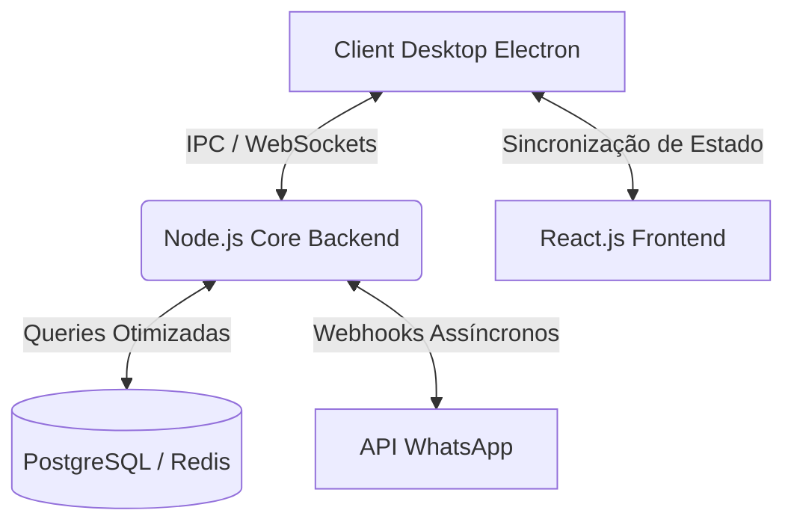

# ⚡ Innovation IA - Enterprise WhatsApp CRM & Automation

**CRM independente, de alta performance e pronto para produção, focado em automação de WhatsApp. Atualmente em operação gerenciando alto volume de tráfego real.**

 

O <b>Innovation IA</b> não é uma prova de conceito (PoC). É um ecossistema CRM <i>enterprise-grade</i>, testado em batalha, construído para orquestrar e automatizar interações do WhatsApp em escala. Desenvolvido sob uma arquitetura orientada a eventos (Event-Driven), ele gerencia roteamento assíncrono para múltiplos atendentes, processamento de mídias em tempo real e funis de vendas complexos.

---

## 🏗️ Arquitetura de Sistemas & Engenharia

A aplicação foi desenhada com uma arquitetura desacoplada, garantindo alta disponibilidade, tolerância a falhas e ciclos rápidos de deploy. O ecossistema é encapsulado em uma camada **Electron**, fornecendo uma experiência nativa de SO (Sistema Operacional) com integração profunda ao sistema de arquivos e gerenciamento de processos em background.

### 🧠 Destaques Técnicos (Core)

- **Mensageria Orientada a Eventos:** Comunicação bidirecional em tempo real via WebSockets (Socket.io), garantindo latência sub-segundo para entrega de mensagens e sincronização de status entre dezenas de usuários simultâneos.
- **Pipeline de Processamento de Mídia:** Manipulação direta de binários (Streams/Buffers) para Áudio (Ogg/Opus), Documentos e Imagens. Transmissão com zero perda de pacotes e *footprint* de memória otimizado, evitando vazamento de memória (Memory Leaks) em longas execuções.
- **Integração Nativa de SO (Electron):** Contorna as limitações de browsers padrão (sandboxing), oferecendo cache local no sistema de arquivos, notificações nativas e processos dedicados independentes do ciclo de vida da interface.
- **Concorrência e Gestão de Estado:** Tratamento robusto de *Race Conditions* durante a atribuição simultânea de tickets para atendentes. Prevenção de estado obsoleto usando atualizações de UI otimistas e gerenciadores de fila persistentes.

---

## 🚀 Capacidades e Features

<table>
  <tr>
    <td width="50%">
      <h3>🤖 Automação Inteligente</h3>
      Roteamento assíncrono não-bloqueante. Capaz de processar filas massivas de *inbound* (mensagens recebidas) sem travar o Event Loop principal do Node.js.
    </td>
    <td width="50%">
      <h3>🎙️ CRM Multi-Mídia</h3>
      Muito além de bots de texto. Integração profunda com fluxos de áudio e arquivos, preservando a experiência humanizada. Processamento de *streams* customizado para arquivos pesados.
    </td>
  </tr>
  <tr>
    <td width="50%">
      <h3>📅 Orquestração de Funil</h3>
      Motores de agendamento e *follow-up* que rastreiam as máquinas de estado dos clientes. Normalização de dados e indexação para buscas com complexidade O(1) em fases críticas de vendas.
    </td>
    <td width="50%">
      <h3>🔒 Segurança Enterprise</h3>
      Isolamento estrito de tokens proprietários. Variáveis de ambiente protegidas e binários do instalador (*.exe*) blindados contra engenharia reversa básica.
    </td>
  </tr>
</table>

---

## ⚙️ Pipeline de Build e Distribuição

O projeto conta com um pipeline de build automatizado capaz de gerar instaladores `Zero-Config` em questão de minutos.

<b>Ver Detalhes da Infraestrutura de Build</b>

 

- **Electron-Winstaller:** Utiliza o motor NSIS por baixo dos panos para gerar *deployments* Windows profissionais, com instalação em um clique.
- **Pronto para Delta Updates:** Arquitetura estruturada para atualizações silenciosas OTA (*Over-The-Air*), minimizando atrito para o usuário final.
- **Asset Management Automatizado:** Scripts Node.js puros (`build-installer.js`) que lidam com conversões de ícones em tempo de build, enxugamento de pacotes (*tree-shaking*) e *pruning* de dependências antes da compilação final.

---

## 💡 Visão de Engenharia & Impacto

O desenvolvimento deste software consolida o domínio completo do **Ciclo de Vida de Software (SDLC)**, evidenciando:

1. **Decisões Arquiteturais Sólidas:** Adoção de WebSockets em vez de Long Polling para lidar com a concorrência em tempo real, diminuindo drasticamente o overhead de rede e uso de CPU do servidor.
2. **Otimização de Performance:** Mitigação de re-renderizações cíclicas no React em listas virtuais com dezenas de milhares de mensagens, garantindo *60 FPS* na interface mesmo sob estresse.
3. **Product Sense:** A capacidade de pegar um back-end altamente complexo (composto por bancos de dados relacionais e em cache) e abstraí-lo num produto Desktop fluido e instalável com um único clique para o usuário final.

---

<i>Arquitetado para Escala. Construído para Performance.</i>

